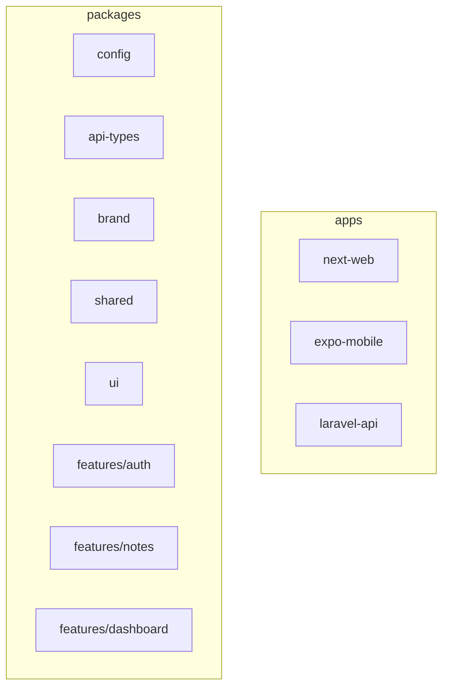
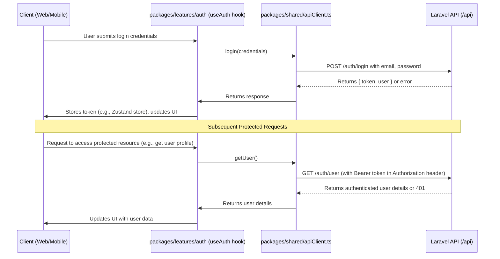

# LEARNING GUIDE

## I. Introduction

**Purpose:** Provide a comprehensive learning resource for developers building a full-stack authenticated notes application within this monorepo.

**Target Audience:** Developers looking to understand monorepo architecture, Tamagui styling, type-safe API interactions, and authentication flows.

**What You'll Learn:**

- How to navigate and structure a monorepo with Yarn Workspaces and Turborepo.
- Setting up and customizing Tamagui for cross-platform UI.
- Defining and validating types with Zod.
- Integrating Laravel Sanctum for authentication.
- Building and integrating a showcase feature (Authenticated Notes Wall) end-to-end.

**Monorepo Structure:**
Below is a high-level overview of the monorepo layout:



## II. Getting Started

### System Requirements

- Node.js >= 16.x
- Yarn (v1 or v3)
- PHP >= 8.0
- Composer
- Expo CLI (`npm install -g expo-cli`)

### Installation

```bash
yarn install
```

### Running Applications

- **Web (Next.js):**

```bash
cd apps/next-web && yarn dev
```

- **Mobile (Expo):**

```bash
cd apps/expo-mobile && expo start
```

- **API (Laravel):**

```bash
cd apps/laravel-api && php artisan serve
```

### Key Scripts

- `yarn dev`: Run all apps in development mode via Turborepo.
- `yarn build`: Build all apps and packages.
- `yarn lint`: Run ESLint across the monorepo.
- `yarn test`: Run tests.

## III. Core Concepts & Architecture

### Monorepo (Yarn Workspaces & Turborepo)

We use Yarn workspaces to share code across packages and Turborepo to orchestrate scripts and builds.

### Code Quality & Development Practices

To maintain a high standard of code quality and consistency across the monorepo, several tools and practices are in place:

- **ESLint for Linting:**

  - ESLint is configured to enforce coding standards and catch potential errors early.
  - Configurations include support for TypeScript, React (including hooks), Next.js, and accessibility (jsx-a11y).
  - The `@tanstack/eslint-plugin-query` is integrated to enforce best practices for React Query usage.
  - You can run the linter across the entire workspace using the `yarn lint` script (defined in the root `package.json`).
  - ESLint configuration files can be found at the root (`.eslintrc.js`, `eslint.config.js`) and potentially within individual packages if specific overrides are needed.

- **Prettier for Code Formatting:**

  - Prettier is used for automatic code formatting to ensure a consistent style.
  - The configuration is in `.prettierrc.json` at the root.
  - It's recommended to integrate Prettier with your IDE for format-on-save functionality.

- **Husky & lint-staged for Pre-commit Hooks:**
  - Husky (`.husky/`) is used to manage Git hooks.
  - A `pre-commit` hook is set up to run `lint-staged`.
  - `lint-staged` (configured in the root `package.json`) ensures that ESLint and Prettier are run on staged files before they are committed. This helps prevent committing code that doesn't adhere to project standards.

These tools help automate code quality checks, making the development process smoother and contributing to a more maintainable codebase.

### Tamagui and Brand Integration

Tamagui is the universal UI toolkit used for building consistent user interfaces across the Next.js web app and Expo mobile app. The core of its setup involves a sophisticated theming system built upon `packages/brand` and configured in `packages/config`.

#### 1. Brand Definition (`packages/brand/src/colors.ts`)

This file is the heart of the visual identity, defining color palettes and using Tamagui's `theme-builder` to generate themes.

- **Color Palettes:** Multiple palettes are defined, each with a range of shades (typically 50 to 900):

  - `primaryPalette`: (Red-based in this starter) For primary UI elements.
  - `secondaryPalette`: (Blue-based) For secondary elements.
  - `redPalette`, `greenPalette`, `yellowPalette`: For semantic states like errors, success, and warnings.

  ```typescript
  // Example: packages/brand/src/colors.ts (snippet of primaryPalette)
  const primaryPalette = {
    primary50: '#FFEBEE', // Lightest
    // ... other shades
    primary500: '#E53935', // Main brand color
    // ... other shades
    primary900: '#8B0000', // Darkest
  };
  // Similar structures for secondary, red, green, yellow palettes.

  export const palettes = {
    /* Merged object of all palettes */
  };
  ```

- **Legacy `brandColors`:** A simple object mapping semantic names to specific palette shades or hex values for direct use or backward compatibility.

  ```typescript
  // packages/brand/src/colors.ts
  export const brandColors = {
    primary: primaryPalette.primary500,
    backgroundLight: '#FFFFFF',
    textLight: '#000000',
    // ... and so on for dark theme colors, neutrals etc.
  };
  ```

- **Theme Building with `createThemeBuilder`:**

  - The `themesBuilder` is configured with the defined palettes (e.g., `primaryPalette` for light and dark variations).
  - Templates are used to map palette shades to theme variables (e.g., `primary50` to `primary900`).
  - `light` and `dark` themes are built using these palettes and templates.
  - Crucially, after the base themes are built, the semantic palettes (red, green, yellow) are manually injected into each theme. This makes colors like `$red500` or `$green100` directly available as theme tokens (e.g., `<Text color="$red500">Error</Text>`).

  ```typescript
  // packages/brand/src/colors.ts (conceptual snippet of theme building)
  import { createThemeBuilder } from '@tamagui/theme-builder';
  // ... palettes defined ...

  export const themesBuilder = createThemeBuilder()
    .addPalettes({
      light: [
        /* primary shades */
      ],
      dark: [
        /* reversed primary shades */
      ],
    })
    .addTemplates({ base: { primary50: 0, /* ... */ primary900: 9 } })
    .addThemes({
      light: { template: 'base', palette: 'light' },
      dark: { template: 'base', palette: 'dark' },
    });

  export const themes = themesBuilder.build();

  // Inject semantic palettes (red, green, yellow) into built themes
  Object.keys(themes).forEach((themeName) => {
    // ... logic to add redPalette, greenPalette, yellowPalette entries ...
  });
  ```

  The `themes` object (containing fully constructed light and dark themes with all color tokens) and `palettes` are exported from `packages/brand/src/index.ts` (which re-exports from `colors.ts`).

#### 2. Central Tamagui Configuration (`packages/config/src/tamagui.config.ts`)

This file consumes the definitions from `packages/brand` to create the final Tamagui configuration used by the applications.

```typescript
// packages/config/src/tamagui.config.ts (simplified structure)
import { createAnimations } from '@tamagui/animations-react-native';
import { createInterFont } from '@tamagui/font-inter';
import { createMedia } from '@tamagui/react-native-media-driver';
import { shorthands } from '@tamagui/shorthands';
import { tokens as defaultTokens } from '@tamagui/themes';
import {
  brandColors, // For direct semantic color access if needed
  palettes, // Full set of color palettes
  themes as brandThemes, // Themes built by theme-builder in brand package
} from '@hello-world/brand';
import { createTamagui } from '@tamagui/core';
import * as lucideIcons from '@tamagui/lucide-icons';

// ... animations, fonts, media queries setup ...

// Create comprehensive tokens by merging Tamagui defaults with our brand palettes
const customTokens = {
  ...defaultTokens,
  color: {
    ...defaultTokens.color,
    ...palettes, // Makes $primary50, $secondary300 etc. available
    // Add specific semantic overrides from brandColors if needed
    appBackground: brandColors.backgroundLight, // Example
  },
};

// Enhance themes from brand package with more semantic overrides if necessary
const customThemes = {
  ...brandThemes, // Includes light & dark themes from theme-builder
  light: {
    ...brandThemes.light,
    background: brandColors.backgroundLight, // Specific semantic mapping
    color: brandColors.textLight,
    // ... other semantic tokens for light theme
  },
  dark: {
    ...brandThemes.dark,
    background: brandColors.backgroundDark,
    color: brandColors.textDark,
    // ... other semantic tokens for dark theme
  },
};

const config = createTamagui({
  animations,
  // ... other Tamagui settings (shorthands, fonts, media) ...
  themes: customThemes, // Use our fully constructed themes
  tokens: customTokens, // Use our comprehensive tokens
  icons: lucideIcons,
  defaultTheme: 'light',
});

export default config;
```

This central `config` is then typically imported by the app-specific `tamagui.config.ts` files in `apps/next-web` and `apps/expo-mobile`, or used directly by the `TamaguiProvider`. This setup ensures a consistent and rich theming experience across platforms.

### Type-Safe API Interaction with Zod

The primary API type definitions and validation schemas are managed in the `packages/api-types` directory. This package contains:

- Manually crafted Zod schemas (e.g., `src/authSchemas.ts`, `src/noteSchemas.ts`) used for detailed client-side validation and by the manual API client.
- Auto-generated TypeScript interfaces and a Zodios client (in `src/generated/`) derived from the backend's OpenAPI specification, ensuring a close match with the API contract.

Our primary API client, located in `packages/shared/src/apiClient.ts`, utilizes the manual Zod schemas for request and response validation.

**Manual Zod Schemas Example (`packages/api-types/src/authSchemas.ts`):**

```ts
import { z } from 'zod';

// Schema for the user object, often part of responses
export const UserSchema = z.object({
  id: z.number(),
  name: z.string(),
  email: z.string().email(),
  created_at: z.string(),
  updated_at: z.string(),
});

// Schema for the login request payload
export const LoginRequestSchema = z.object({
  email: z.string().email(),
  password: z.string(),
});

// Schema for the login response payload
export const LoginResponseSchema = z.object({
  token: z.string(),
  user: UserSchema,
});
```

**Extended Zod Schemas for Custom Error Messages (`packages/api-types/src/extendedSchemas.ts`):**

For a more user-friendly form validation experience, this project utilizes "extended schemas" located in `packages/api-types/src/extendedSchemas.ts`. These schemas take the Zod schemas (often the auto-generated and then post-processed ones) and augment them with custom error messages.

- **Purpose:** To provide specific, helpful error messages for validation failures (e.g., "Please enter your name" instead of a generic Zod error). These extended schemas become the **single source of truth for validation error messages** used in frontend forms.
- **Schema Generation & Extension Flow:**

  1. **OpenAPI Spec:** Laravel generates an `openapi.json` specification.
  2. **Initial Generation:** Our custom-built script `packages/api-types/scripts/generate-api-types.js` (which we created specifically for this project, not part of any package) creates base Zod schemas from the OpenAPI spec (e.g., `schemas.auth_register_Body` in `src/generated/api-client.ts`).
  3. **Post-processing:** Our custom-built script `packages/api-types/scripts/post-process-schemas.js` (also created specifically for this project) automatically modifies these generated schemas, notably adding `.min(1)` validation to fields marked as required in the OpenAPI spec.
  4. **Manual Extension:** Developers then manually create or update schemas in `extendedSchemas.ts` by taking a post-processed schema and using Zod's `.extend()` or by defining fields with custom messages directly (e.g., `.min(1, { message: "This field is required." })`).

- **Zod Validation and Empty Strings:**
  A key consideration for form validation is how Zod handles empty strings.

  - `z.string({ required_error: "Field is required" })`: This error **only triggers if the field is missing entirely** (i.e., `undefined`).
  - `z.string().min(1, { message: "Field is required" })`: This error **will trigger for empty strings (`""`)**, which is what HTML forms typically submit for empty inputs.
    Therefore, for required form fields, `.min(1, { message: "..." })` is used in the extended (or post-processed) schemas to ensure empty submissions are caught and a user-friendly message is displayed.

- **Usage Example:**

  ```typescript
  // packages/api-types/src/extendedSchemas.ts
  import { z } from 'zod';
  import { schemas } from './generated/api-client'; // Base generated schemas

  // Assuming schemas.auth_register_Body is the post-processed generated schema
  export const ExtendedRegisterSchema = schemas.auth_register_Body.extend({
    name: z
      .string()
      .min(1, { message: 'Please enter your name' })
      .max(255, { message: 'Name must be less than 255 characters' }),
    email: z
      .string()
      .min(1, { message: 'Please enter your email' })
      .email({ message: 'Please enter a valid email address' }),
    // ... other fields with custom messages
  });

  // In your form component:
  // import { ExtendedRegisterSchema } from '@hello-world/api-types';
  // const validationResult = ExtendedRegisterSchema.safeParse(formData);
  // if (!validationResult.success) { /* display errors */ }
  ```

  When validation rules change in the backend (Laravel controllers), ensure that:

  1. The OpenAPI spec is regenerated.
  2. Our custom-built `generate-api-types` and `post-process-schemas` scripts (which we created specifically for this project) are run.
  3. The corresponding error messages in `extendedSchemas.ts` are updated to match.

The `packages/api-types/src/index.ts` file should export these extended schemas (e.g., `export * from './extendedSchemas';`) so they can be easily imported by feature packages.

#### Validation and API Call in `shared/apiClient.ts` (Manual Client)

The primary API client used by the feature hooks in this starter is the **manual Axios client** defined in `packages/shared/src/apiClient.ts`. This client explicitly uses the **manual Zod schemas** (like `LoginRequestSchema`, `NoteSchema` from `packages/api-types/src/*Schemas.ts`) for validating request payloads and parsing response data. It also integrates Axios interceptors for automatically attaching authentication tokens (from `tokenStore`) and performing global error handling/logging.

```ts
// Example from packages/shared/src/apiClient.ts (simplified)
import axiosInstance from './axiosConfig'; // Assuming axiosInstance is configured elsewhere
import {
  LoginRequestSchema,
  LoginRequest,
  LoginResponseSchema,
  LoginResponse,
} from '@hello-world/api-types/src/authSchemas'; // Correct path to manual schemas

export const authApi = {
  login: async (credentials: LoginRequest): Promise<LoginResponse> => {
    // Validate request payload (optional here if validated at point of call)
    LoginRequestSchema.parse(credentials);
    const response = await axiosInstance.post('/auth/login', credentials); // Correct endpoint
    // Validate and parse response payload
    return LoginResponseSchema.parse(response.data);
  },
  // ... other auth methods like register, logout, getUser
};
```

(Note: The actual `apiClient.ts` in `packages/shared` has a slightly different structure for exporting methods, e.g. `apiClient.auth.login`, which will be reflected in later updates to this guide where `useAuth` is discussed.)

#### Auto-generated API Types and Client from OpenAPI

In addition to the manual Zod schemas, the `packages/api-types` package also includes a system for auto-generating types directly from the Laravel backend's OpenAPI specification. This provides another layer of type safety and an alternative way to interact with the API.

- **Source:** The Laravel backend, using a tool like Scramble (see `apps/laravel-api/config/scramble.php`), generates an `openapi.json` file (located in `apps/laravel-api/storage/openapi.json`). This file describes the entire API contract.
- **Custom Scripts:** To solve the API synchronization challenge, we created a set of custom scripts (not part of any external package):
  - `packages/api-types/scripts/generate-api-types.js`: This custom script consumes the `openapi.json` file and orchestrates the type generation process.
  - `packages/api-types/scripts/post-process-schemas.js`: This custom script enhances the generated schemas by adding validation rules for required fields.
  - `packages/api-types/scripts/check-endpoints.js`: This custom script verifies consistency between defined and implemented API endpoints.
- **Tools Used by Our Scripts:**
  - `openapi-typescript`: Generates pure TypeScript interfaces for all API paths, request bodies, and responses. These are output to `packages/api-types/src/generated/api-types.ts`. These types (e.g., `components['schemas']['NoteResource']`) offer a direct representation of the API contract without Zod's runtime validation.
  - `openapi-zod-client`: Generates a fully functional Zodios API client, along with its own set of Zod schemas derived from the OpenAPI spec. These are output to `packages/api-types/src/generated/api-client.ts`. This provides an alternative, ready-to-use typed client.
- **Generated Files Location:** All generated artifacts are placed in `packages/api-types/src/generated/`. An `index.ts` file in this directory exports the key generated components.

**Purpose and Usage:**

- These generated types and the Zodios client offer a robust way to ensure frontend types stay perfectly in sync with the backend API definition.
- While this starter project currently emphasizes the manual `shared/apiClient.ts` (using manual Zod schemas for fine-grained validation control and integration with global stores like Zustand), the generated artifacts are available and can be explored as an alternative or complementary approach. For instance, feature hooks might use types derived from the generated Zod schemas for their function signatures, even if they call the manual API client.

This dual approach (manual + generated types) provides flexibility. Our custom-built `generate-api-types` script (and subsequent `post-process-schemas` script) should be run whenever the Laravel API contract changes to keep the generated types up-to-date.

- **Endpoint Check Script:** The `packages/api-types/scripts/check-endpoints.js` script (run via `yarn check-api-endpoints` from the root) is another custom script we created specifically for this project to help verify consistency between the generated types/client and the actual API structure, although its specific checks may evolve. Like the other scripts, it's not part of any external package but was created to solve our specific API synchronization challenges.

#### Example Usage of Auto-Generated Client (`shared/apiClient.example.ts`)

To illustrate how the auto-generated Zodios client and schemas can be used, the file `packages/shared/src/apiClient.example.ts` provides a practical example. It demonstrates:

- Importing `createApiClient` (the generated Zodios client factory) and `schemas` (the generated Zod schemas) from `@hello-world/api-types`.
- Creating an instance of the generated client (`baseClient`).
- Adding Axios interceptors directly to the `baseClient.axios` instance for token handling and error logging (similar to the manual client).
- Wrapping the `baseClient` calls within a structured `apiClient` object, adding try/catch blocks for more specific error logging around each API call.
- Using types inferred directly from the generated `schemas` object (e.g., `z.infer<typeof schemas.auth_login_Body>`).

This example serves as a reference for developers who might prefer using the fully generated client approach, showcasing how to enhance it with necessary features like authentication headers and robust error handling. It highlights the alternative pattern available within the `api-types` package.

#### Important Note on Current Type Usage & Exports in Shared Packages:

As of the current implementation, there are a few points to be aware of regarding how types and the API client are exported and consumed:

1.  **`packages/shared/src/index.ts` Exports:**
    The `useAuth.ts` hook imports `apiClient` and `schemas` from `@hello-world/shared` (e.g., `import { apiClient, schemas } from '@hello-world/shared';`). However, the `packages/shared/src/index.ts` file currently does not explicitly export the main `apiClient` (from `./apiClient.ts`) or the `schemas` object (which would typically be the re-export of generated Zod schemas from `packages/api-types/src/generated/api-client.ts`). For the imports in `useAuth.ts` to resolve correctly as written, `packages/shared/src/index.ts` would need to be updated to include:

    ```typescript
    // Potential additions to packages/shared/src/index.ts
    export * from './apiClient'; // To export the manual Axios client
    export { schemas } from '@hello-world/api-types/src/generated/api-client'; // To re-export generated Zod schemas
    ```

2.  **Inconsistent Zod Type Sourcing in Feature Hooks:**

    - `packages/features/auth/src/hooks/useAuth.ts` appears to intend to use types derived from the _generated_ Zod schemas (e.g., `type LoginRequest = z.infer<typeof schemas.auth_login_Body>;`).
    - `packages/features/notes/src/hooks/useNotes.ts` uses types derived from the _manual_ Zod schemas (e.g., `import { CreateNoteRequest } from '@hello-world/api-types';`).

    This inconsistency in how feature hooks source their Zod types (manual vs. generated names/structures) can lead to confusion. It's recommended to:

    - Ensure `packages/shared/src/index.ts` correctly exports the intended `apiClient` and any shared schemas/types.
    - Adopt a consistent pattern across all feature hooks for importing and using Zod types/schemas, whether preferring the manual ones from `@hello-world/api-types/src/*Schemas.ts` or types derived from the generated `schemas` object. Using the manual Zod schema types (like `CreateNoteRequest`) directly from `@hello-world/api-types` (which should export them from its own `index.ts`) is often clearer if the manual API client itself relies on these specific manual schemas for its internal validation.

Addressing these points will improve the clarity and maintainability of the type interactions within the project.

### State Management Approach

This project uses a thoughtful, layered approach to state management that follows modern best practices by using the right tool for each type of state:

#### 1. React Query for Server State

The application uses TanStack Query (React Query) for all server-sourced data, such as notes and user information. This handles:

- Caching and automatic refetching
- Loading and error states
- Mutations with optimistic updates
- Query invalidation

Example from `packages/features/notes/src/hooks/useNotes.ts`:

```ts
export function useGetNotes() {
  return useQuery<GetNotesResponse, Error>({
    queryKey: ['notes'],
    queryFn: () => apiClient.notes.getNotes(),
  });
}

export function useCreateNote() {
  const queryClient = useQueryClient();
  return useMutation<unknown, Error, CreateNoteRequest>({
    mutationFn: (newNoteData: CreateNoteRequest) =>
      apiClient.notes.createNote(newNoteData),
    onSuccess: () => {
      queryClient.invalidateQueries({ queryKey: ['notes'] });
    },
  });
}
```

#### 2. Zustand for Persistent Global State

Zustand is used selectively for state that needs to be:

- Persisted between sessions
- Accessible throughout the app
- Not server state

The primary example is the authentication token store in `packages/features/auth/src/stores/tokenStore.ts`:

```ts
export const useTokenStore = create<TokenState>()(
  persist(
    (set, get) => ({
      token: null,
      setToken: (token) => set({ token }),
      clearToken: () => set({ token: null }),
      hasToken: () => Boolean(get().token),
    }),
    {
      name: 'auth-token-storage',
      storage: createJSONStorage(() => SecureStorage),
    }
  )
);
```

This is one of the few appropriate uses of Zustand in our architecture.

#### 3. useState for Component-Local State

Local component state is managed with React's useState hook, particularly for:

- Form inputs (e.g., in LoginScreen, RegisterScreen, AddNoteForm)
- UI state that doesn't need to be shared (e.g., loading indicators, modals)
- Component-specific state that doesn't affect other parts of the application

Example from `packages/ui/src/AddNoteForm.tsx`:

```tsx
export const AddNoteForm: React.FC<AddNoteFormProps> = ({
  onSubmit,
  isLoading = false,
}) => {
  const [title, setTitle] = useState('');
  const [content, setContent] = useState('');

  const handleSubmit = () => {
    if (!isLoading) {
      onSubmit({ title, content });
    }
  };
  // ...
};
```

#### 4. Custom Hooks for Specialized State

The application uses custom hooks to encapsulate specific state management needs:

- `useFormErrors` for form validation errors
- `useAuth` for authentication state and operations

These hooks often combine multiple state management approaches (React Query, Zustand, useState) to provide a cohesive API.

#### When to Consider More Global State

Additional Zustand stores might be appropriate in specific scenarios:

1. Complex UI state sharing across unrelated components
2. Performance issues from excessive re-renders due to prop drilling
3. Multi-step workflows where state needs to persist across routes/views

However, for most features, the combination of React Query for server state, Zustand for minimal global state, and useState for component-local state provides a clean, maintainable architecture that avoids unnecessary complexity.

### Authentication Deep Dive

#### Overview & Architecture

The Laravel backend uses Sanctum for API token authentication. The client (Next.js/Expo app) requests a token upon successful login or registration and then sends this token in the `Authorization` header for protected endpoints.

**Authentication Flow Diagram:**



This flow involves:

1.  User provides credentials (email/password).
2.  The `useAuth` hook (via `shared/apiClient.ts`) calls `POST /api/auth/login` or `POST /api/auth/register`.
3.  Laravel API validates credentials, and if successful, creates an API token and returns it along with user data.
4.  The client stores this token securely and includes it as a Bearer token in the `Authorization` header for subsequent requests to protected API routes (e.g., `GET /api/auth/user`, `POST /api/notes`).
5.  Logout involves calling `POST /api/auth/logout`, which invalidates the token on the server.

#### Key Modules & Handlers

- **`packages/features/auth`**: Contains the UI screens (`LoginScreen.tsx`, `RegisterScreen.tsx`) and the core `useAuth.ts` hook which orchestrates authentication logic using React Query for mutations (login, register, logout) and queries (fetching user data).
- **`packages/features/auth/src/stores/tokenStore.ts`**: A Zustand store for managing the authentication token state globally.
- **`packages/shared/src/apiClient.ts`**: The central API client. Its request interceptor automatically attaches the Bearer token from `tokenStore` to outgoing requests. It uses manual Zod schemas from `packages/api-types` for request/response validation.
- **`apps/laravel-api/app/Http/Controllers/AuthController.php`**: Handles registration, login, logout, and fetching user details on the backend.
- **`apps/laravel-api/routes/api.php`**: Defines the `/auth/*` routes.
- **Laravel Sanctum**: Configured in `apps/laravel-api/config/sanctum.php` for API token capabilities.

#### Frontend Auth Components

- **LoginScreen / RegisterScreen** (e.g., `packages/features/auth/src/screens/LoginScreen.tsx`): These components typically use forms to capture user input and then utilize the mutations provided by the `useAuth` hook (e.g., `loginMutation.mutateAsync(credentials)`).

```tsx
// Simplified example of using useAuth in a LoginScreen
import { useAuth } from '@hello-world/auth'; // Assuming features/auth exports useAuth

export function LoginScreen() {
  const { loginMutation } = useAuth();

  const handleLogin = async (credentials) => {
    try {
      const result = await loginMutation.mutateAsync(credentials);
      // Handle successful login, e.g., navigation
    } catch (error) {
      // Handle login error
    }
  };
  // ... form implementation using handleLogin
  return <></>; // Placeholder for actual UI
}
```

#### Protecting Routes & Components

The `useAuth` hook typically provides user state and authentication status (e.g., `user`, `isAuthenticated`). This can be used to conditionally render components or implement route guards in `apps/next-web` (e.g., in page components or layout) and `apps/expo-mobile` (e.g., using Expo Router's layout routes).

```tsx
// Example: apps/next-web/app/protected-route/page.tsx
import { useAuth } from '@hello-world/auth';
import { useEffect } from 'react';
// import { useRouter } from 'next/navigation'; // For redirection

export default function ProtectedPage() {
  const { user, isAuthenticated, isLoadingUser } = useAuth();
  // const router = useRouter();

  useEffect(() => {
    if (!isLoadingUser && !isAuthenticated) {
      // router.push('/login'); // Example redirection
    }
  }, [isLoadingUser, isAuthenticated /*, router*/]);

  if (isLoadingUser) return <p>Loading...</p>;
  if (!isAuthenticated) return <p>Redirecting...</p>; // Or show login prompt

  return <div>Welcome, {user?.name}! This is a protected page.</div>;
}
```

#### Authenticated User Context / Provider

While the `useAuth` hook and `tokenStore` manage global auth state, an `AuthProvider` component might still be used at the root of the applications (`apps/next-web/app/providers.tsx`, `apps/expo-mobile/providers.tsx`) to initialize React Query's `QueryClientProvider` or other global contexts that `useAuth` might depend upon or interact with.

#### Zod Schemas for Auth API (`packages/api-types/src/authSchemas.ts`)

The manual Zod schemas in `packages/api-types` define the expected structure for API requests and responses, used by `shared/apiClient.ts`.

**Example: `RegisterRequestSchema`**

```ts
import { z } from 'zod';

// (UserSchema would be defined above as shown previously)

export const RegisterRequestSchema = z
  .object({
    name: z
      .string({ required_error: 'Name is required' })
      .min(1, { message: 'Name is required' }),
    email: z
      .string({ required_error: 'Email is required' })
      .email({ message: 'Please enter a valid email address' }),
    password: z
      .string({ required_error: 'Password is required' })
      .min(6, { message: 'Password must be at least 6 characters' }), // Frontend validation
    password_confirmation: z.string({
      required_error: 'Password confirmation is required',
    }),
  })
  .refine((data) => data.password === data.password_confirmation, {
    message: "Passwords don't match",
    path: ['password_confirmation'], // Error applies to this field
  });

// The backend (AuthController@register) also validates,
// typically with Laravel's default password rule (e.g., min 8 characters).
// Frontend validation provides immediate feedback.
```

## IV. Showcase Feature: Authenticated Notes Wall

Follow these steps to implement the Authenticated Notes Wall:

1. **Defining Data Contracts**  
   The data contracts for notes are defined using Zod in `packages/api-types/src/noteSchemas.ts`. These schemas are used by the `shared/apiClient.ts` for validation.

   ```ts
   // packages/api-types/src/noteSchemas.ts
   import { z } from 'zod';

   export const NoteSchema = z.object({
     id: z.number(),
     title: z.string(),
     content: z.string(),
     userId: z.number(),
     authorName: z.string().optional(), // Included when note is fetched with author
     created_at: z.string(), // ISO date string
     updated_at: z.string(), // ISO date string
   });
   export type Note = z.infer<typeof NoteSchema>;

   // Schema for the response when fetching a list of notes
   export const GetNotesResponseSchema = z.array(NoteSchema);
   export type GetNotesResponse = z.infer<typeof GetNotesResponseSchema>;

   // Schema for the request payload when creating a new note
   export const CreateNoteRequestSchema = z.object({
     title: z.string(),
     content: z.string(),
   });
   export type CreateNoteRequest = z.infer<typeof CreateNoteRequestSchema>;

   // Schema for the response after creating a note (it's the note itself)
   export const CreateNoteResponseSchema = NoteSchema;
   export type CreateNoteResponse = z.infer<typeof CreateNoteResponseSchema>;
   ```

2. **Setting up the API Endpoint**
   The Laravel backend provides endpoints for note operations.

   **Model (`apps/laravel-api/app/Models/Note.php`):**
   The `Note` model defines fillable attributes and its relationship to the `User` model.

   ```php
   namespace App\Models;
   use Illuminate\Database\Eloquent\Model;
   use Illuminate\Database\Eloquent\Relations\BelongsTo;

   class Note extends Model
   {
       protected $fillable = ['user_id', 'title', 'content'];

       public function user(): BelongsTo
       {
           return $this->belongsTo(User::class);
       }
   }
   ```

   **Controller (`apps/laravel-api/app/Http/Controllers/NoteController.php`):**
   Handles the logic for listing and creating notes.

   ```php
   namespace App\Http\Controllers;
   use Illuminate\Http\Request;
   use App\Models\Note;
   use App\Http\Resources\NoteResource; // Important for consistent response structure
   use Illuminate\Http\JsonResponse;

   class NoteController extends Controller
   {
       // List all notes (publicly accessible)
       public function index(): JsonResponse
       {
           $notes = Note::with('user')->get(); // Eager load user (author)
           return response()->json(NoteResource::collection($notes));
       }

       // Create a new note (authenticated users only)
       public function store(Request $request): JsonResponse
       {
           $validated = $request->validate([
               'title' => 'required|string|max:255',
               'content' => 'required|string',
           ]);

           $note = Note::create([
               'user_id' => $request->user()->id, // Associate with authenticated user
               'title' => $validated['title'],
               'content' => $validated['content'],
           ]);
           $note->load('user'); // Ensure user relation is loaded for the resource
           return response()->json(new NoteResource($note), 201);
       }
   }
   ```

   The `NoteResource` (in `app/Http/Resources/NoteResource.php`) formats the note data, including `authorName`.

   **Routes (`apps/laravel-api/routes/api.php`):**
   Defines how HTTP requests map to controller actions.

   ```php
   use App\Http\Controllers\NoteController;

   // Public endpoint: retrieves all notes
   Route::get('/notes', [NoteController::class, 'index']);
   // Authenticated endpoint: creates a new note
   Route::middleware('auth:sanctum')->post('/notes', [NoteController::class, 'store']);
   ```

   Note: `GET /api/notes` is public, while `POST /api/notes` requires authentication.

3. **Creating Shared UI Components**
   Reusable Tamagui components for displaying notes are in `packages/ui/src`.

   **`NoteCard.tsx` (`packages/ui/src/NoteCard.tsx`):**
   Displays a single note.

   ```tsx
   import React from 'react';
   import { YStack, Text } from 'tamagui';
   import type { Note } from '@hello-world/api-types'; // Uses the manual Zod schema type

   interface NoteCardProps {
     note: Note;
   }

   export const NoteCard: React.FC<NoteCardProps> = ({ note }) => (
     <YStack
       padding="$3"
       borderRadius="$3"
       borderWidth={1}
       borderColor="$borderColor"
       gap="$2"
     >
       <Text fontSize="$6" fontWeight="bold">
         {note.title}
       </Text>
       <Text>{note.content}</Text>
       {note.authorName && <Text fontSize="$2">By: {note.authorName}</Text>}
       <Text fontSize="$1" color="$gray10">
         Created: {new Date(note.created_at).toLocaleDateString()}
       </Text>
     </YStack>
   );
   ```

   **`NotesList.tsx` (`packages/ui/src/NotesList.tsx`):**
   Renders a list of `NoteCard` components.

   ```tsx
   import React from 'react';
   import { YStack } from 'tamagui';
   import { NoteCard } from './NoteCard';
   import type { Note } from '@hello-world/api-types';

   interface NotesListProps {
     notes: Note[];
   }

   export const NotesList: React.FC<NotesListProps> = ({ notes }) => (
     <YStack gap="$3">
       {notes.map((note) => (
         <NoteCard key={note.id} note={note} />
       ))}
     </YStack>
   );
   ```

   **`AddNoteForm.tsx` (`packages/ui/src/AddNoteForm.tsx`):**
   A form for creating new notes, typically using `Input` and `Button` from `packages/ui`.

   ```tsx
   // Simplified structure
   import React, { useState } from 'react';
   import { YStack, Button, Input, FormField } from 'tamagui'; // Assuming FormField is a custom or ui component
   import type { CreateNoteRequest } from '@hello-world/api-types';

   interface AddNoteFormProps {
     onSubmit: (data: CreateNoteRequest) => Promise<void>;
     isSubmitting?: boolean;
   }

   export const AddNoteForm: React.FC<AddNoteFormProps> = ({
     onSubmit,
     isSubmitting,
   }) => {
     const [title, setTitle] = useState('');
     const [content, setContent] = useState('');

     const handleSubmit = () => {
       onSubmit({ title, content });
       // Optionally clear form: setTitle(''); setContent('');
     };

     return (
       <YStack gap="$3" as={FormField} /* Tamagui Form might be used here */>
         <Input
           placeholder="Note Title"
           value={title}
           onChangeText={setTitle}
         />
         <Input
           placeholder="Note Content"
           value={content}
           onChangeText={setContent}
           multiline
         />
         <Button onPress={handleSubmit} disabled={isSubmitting}>
           {isSubmitting ? 'Adding...' : 'Add Note'}
         </Button>
       </YStack>
     );
   };
   ```

4. **Developing the Feature Logic**
   The core logic for fetching and creating notes resides in `packages/features/notes/src/hooks/useNotes.ts`, utilizing React Query and the `shared/apiClient.ts`.

   ```ts
   // packages/features/notes/src/hooks/useNotes.ts
   import { apiClient } from '@hello-world/shared';
   import {
     CreateNoteRequest,
     GetNotesResponse,
     Note as NoteType,
   } from '@hello-world/api-types'; // Using manual Zod schema types
   import {
     useQuery,
     useMutation,
     useQueryClient,
   } from '@tanstack/react-query';

   // Hook to fetch all notes
   export function useGetNotes() {
     return useQuery<GetNotesResponse, Error>({
       queryKey: ['notes'], // React Query key
       queryFn: () => apiClient.notes.getNotes(), // Calls the method from shared/apiClient.ts
     });
   }

   // Hook to create a new note
   export function useCreateNote() {
     const queryClient = useQueryClient();
     return useMutation<NoteType, Error, CreateNoteRequest>({
       // Expects CreateNoteRequest, returns a NoteType
       mutationFn: (newNoteData: CreateNoteRequest) =>
         apiClient.notes.createNote(newNoteData), // Calls shared/apiClient.ts
       onSuccess: () => {
         // When a new note is created, invalidate the 'notes' query to refetch the list
         queryClient.invalidateQueries({ queryKey: ['notes'] });
       },
     });
   }
   ```

5. **Integrating into Next.js Web App**
   In `apps/next-web/app/notes/page.tsx` (or a similar protected page like `protected-notes/page.tsx`), you would use these hooks to display notes and the form.

   ```tsx
   // Example: apps/next-web/app/protected-notes/page.tsx
   'use client'; // For Next.js App Router client components
   import { YStack, Text, H1 } from 'tamagui';
   import { NotesList, AddNoteForm } from '@hello-world/ui';
   import { useGetNotes, useCreateNote } from '@hello-world/notes'; // Assuming features/notes exports these
   import { useAuth } from '@hello-world/auth'; // For auth check
   import { useEffect } from 'react';
   // import { useRouter } from 'next/navigation';

   export default function ProtectedNotesPage() {
     const { user, isAuthenticated, isLoadingUser } = useAuth();
     // const router = useRouter(); // For redirection

     // useEffect(() => {
     //   if (!isLoadingUser && !isAuthenticated) router.push('/login');
     // }, [isLoadingUser, isAuthenticated, router]);

     const {
       data: notes,
       isLoading: isLoadingNotes,
       error: notesError,
     } = useGetNotes();
     const { mutate: createNote, isPending: isCreatingNote } = useCreateNote();

     const handleAddNote = async (data: { title: string; content: string }) => {
       try {
         await createNote(data);
       } catch (err) {
         console.error('Failed to create note:', err);
       }
     };

     if (isLoadingUser || isLoadingNotes) return <Text>Loading...</Text>;
     if (!isAuthenticated) return <Text>Please log in to see notes.</Text>; // Or redirect

     return (
       <YStack gap="$4" padding="$4">
         <H1>My Notes</H1>
         <AddNoteForm onSubmit={handleAddNote} isSubmitting={isCreatingNote} />
         {notesError && (
           <Text color="$red10">
             Error fetching notes: {notesError.message}
           </Text>
         )}
         {notes && <NotesList notes={notes} />}
       </YStack>
     );
   }
   ```

6. **Integrating into Expo Mobile App**
   Similarly, in `apps/expo-mobile/app/notes.tsx` or `protected-notes.tsx`, you would use the same hooks and UI components. The cross-platform nature of Tamagui and shared feature packages makes this straightforward.

7. **Integrating Authentication**
   The `POST /api/notes` endpoint is protected. The `shared/apiClient.ts` automatically attaches the auth token. The UI for adding notes should typically only be available to authenticated users. The `useAuth` hook provides `isAuthenticated` and `user` data to control UI visibility. The `GET /api/notes` endpoint is public, so notes can be displayed even to non-authenticated users if desired, though the "Authenticated Notes Wall" implies a protected view. This public GET behavior should be noted.

8. **Review and Key Takeaways**
   - End-to-end type safety with Zod schemas and TypeScript, from API client to UI components.
   - Reusable cross-platform UI components (`packages/ui`) and feature logic (`packages/features/notes`).
   - Centralized API interaction logic in `shared/apiClient.ts`.
   - Clear separation of concerns between backend (Laravel) and frontend applications.
   - Publicly readable notes (`GET /notes`) vs. authenticated creation (`POST /notes`).

### Exercise: Implementing True Protected Notes

Currently, the `/protected-notes` route in the frontend applications simply demonstrates a route protected by authentication. Both the public `/notes` page and the `/protected-notes` page fetch data from the same public `GET /api/notes` endpoint, meaning all notes are visible to everyone.

As an exercise to deepen your understanding, try implementing true data protection for notes:

1.  **Backend Changes (Laravel):**

    - Modify the `GET /api/notes` endpoint (or create a new one, e.g., `GET /api/my-notes`) to only return notes belonging to the currently authenticated user. You'll need to apply the `auth:sanctum` middleware to this route and filter the notes based on `auth()->id()`.
    - Consider if the public `GET /api/notes` endpoint should still exist, perhaps returning only notes marked as "public" (which would require adding a new field to the `notes` table). For this exercise, focusing on a protected endpoint returning only the user's own notes is sufficient.
    - Update the `openapi.json` spec if you change/add endpoints.

2.  **API Types Changes (`packages/api-types`):**

    - Update the manual Zod schemas (`noteSchemas.ts`) if the response structure changes.
    - Regenerate the generated types (`yarn generate:api-types`) if the OpenAPI spec changed.
    - Update extended schemas (`extendedSchemas.ts`) if necessary.

3.  **API Client Changes (`packages/shared`):**

    - Update the `apiClient.notes.getNotes` method (or add a new `getMyNotes` method) in `apiClient.ts` to call the new/modified backend endpoint. Ensure it uses the correct Zod schema for parsing.

4.  **Frontend Changes (`packages/features/notes`, `apps/next-web`, `apps/expo-mobile`):**
    - Update the `useGetNotes` hook in `packages/features/notes/src/hooks/useNotes.ts` (or create `useGetMyNotes`) to use the updated API client method.
    - Ensure the `/protected-notes` page in both Next.js (`apps/next-web/app/protected-notes/page.tsx`) and Expo (`apps/expo-mobile/app/protected-notes.tsx`) uses this hook to fetch and display only the authenticated user's notes.
    - The public `/notes` page should potentially use a different hook/endpoint if you decide to keep a public view (e.g., showing only public notes or none at all).

This exercise involves modifying the full stack – backend routes/controllers, API type definitions, the shared API client, and frontend feature logic – providing valuable practice in connecting all parts of the application securely.

### Exercise: Implementing Note Deletion with Soft Delete

Another valuable feature to implement is the ability for users to delete their own notes. This exercise will help you understand authorization, mutation handling, UI updates, and the concept of soft deletion:

1. **Understanding Hard vs. Soft Deletion:**

   - **Hard Deletion:** Permanently removes records from the database.
   - **Soft Deletion:** Marks records as deleted without actually removing them from the database.

   **Why Soft Deletion is Often Preferred:**

   - **Data Recovery:** Allows for recovery of accidentally deleted data.
   - **Audit Trail:** Maintains a complete history of all data for auditing purposes.
   - **Referential Integrity:** Prevents issues with related data that might reference the deleted record.
   - **Analytics:** Enables analysis of deletion patterns and retention of historical data.
   - **Compliance:** May be required for legal or regulatory compliance in some industries.

2. **Backend Changes (Laravel):**

   - Laravel provides built-in soft delete functionality:
     - Add `use SoftDeletes;` trait to the `Note` model.
     - Add a `deleted_at` timestamp column to the `notes` table via migration:
       ```php
       Schema::table('notes', function (Blueprint $table) {
           $table->softDeletes();
       });
       ```
   - Add a `destroy` method to the `NoteController` that accepts a note ID and soft-deletes the corresponding note:

     ```php
     public function destroy(Request $request, $id): JsonResponse
     {
         $note = Note::findOrFail($id);

         // Authorization check
         if ($note->user_id !== $request->user()->id) {
             return response()->json(['error' => 'Unauthorized'], 403);
         }

         $note->delete(); // This will soft delete with the SoftDeletes trait
         return response()->json(['success' => true]);
     }
     ```

   - Define a new route in `routes/api.php`: `Route::middleware('auth:sanctum')->delete('/notes/{id}', [NoteController::class, 'destroy']);`
   - Update the `openapi.json` spec to include this new endpoint.
   - Optionally, add a `restore` endpoint to undelete notes if needed.

3. **API Types Changes (`packages/api-types`):**

   - Update the manual Zod schemas in `noteSchemas.ts` to include:
     - A schema for the delete response: `{ success: boolean }`
     - Add an optional `deleted_at` field to the `NoteSchema`: `deleted_at: z.string().nullable().optional()`
   - Regenerate the generated types with `yarn generate:api-types`.

4. **API Client Changes (`packages/shared`):**

   - Add a new method to the `apiClient.notes` object in `apiClient.ts`:
     ```ts
     deleteNote: async (noteId: number): Promise<{ success: boolean }> => {
       const response = await axiosInstance.delete(`/notes/${noteId}`);
       return { success: true }; // Or parse a more detailed response if your API returns one
     },
     ```

5. **Feature Hook Changes (`packages/features/notes`):**

   - Add a new mutation hook in `useNotes.ts`:
     ```ts
     export function useDeleteNote() {
       const queryClient = useQueryClient();
       return useMutation<{ success: boolean }, Error, number>({
         mutationFn: (noteId: number) => apiClient.notes.deleteNote(noteId),
         onSuccess: () => {
           // Invalidate and refetch notes after deletion
           queryClient.invalidateQueries({ queryKey: ['notes'] });
         },
       });
     }
     ```
   - Optionally, implement optimistic updates for a better user experience:

     ```ts
     export function useDeleteNote() {
       const queryClient = useQueryClient();
       return useMutation<{ success: boolean }, Error, number>({
         mutationFn: (noteId: number) => apiClient.notes.deleteNote(noteId),
         // Optimistically update the UI
         onMutate: async (noteId) => {
           // Cancel any outgoing refetches
           await queryClient.cancelQueries({ queryKey: ['notes'] });

           // Snapshot the previous value
           const previousNotes = queryClient.getQueryData<Note[]>(['notes']);

           // Optimistically remove the note from the list
           if (previousNotes) {
             queryClient.setQueryData(
               ['notes'],
               previousNotes.filter((note) => note.id !== noteId)
             );
           }

           return { previousNotes };
         },
         // If the mutation fails, roll back to the previous value
         onError: (err, noteId, context) => {
           if (context?.previousNotes) {
             queryClient.setQueryData(['notes'], context.previousNotes);
           }
         },
         // Always refetch after error or success
         onSettled: () => {
           queryClient.invalidateQueries({ queryKey: ['notes'] });
         },
       });
     }
     ```

6. **UI Component Changes:**

   - Add a delete button to the `NoteCard` component:

     ```tsx
     interface NoteCardProps {
       note: Note;
       onDelete?: (noteId: number) => void;
       canDelete?: boolean;
     }

     export const NoteCard: React.FC<NoteCardProps> = ({
       note,
       onDelete,
       canDelete = false,
     }) => (
       <YStack
         padding="$3"
         borderRadius="$3"
         borderWidth={1}
         borderColor="$borderColor"
         gap="$2"
       >
         {/* Existing note content */}
         <Text fontSize="$6" fontWeight="bold">
           {note.title}
         </Text>
         <Text>{note.content}</Text>
         {note.authorName && <Text fontSize="$2">By: {note.authorName}</Text>}
         <Text fontSize="$1" color="$gray10">
           Created: {new Date(note.created_at).toLocaleDateString()}
         </Text>

         {/* Delete button - only shown if canDelete is true */}
         {canDelete && onDelete && (
           <Button
             size="$2"
             theme="red"
             onPress={() => onDelete(note.id)}
             alignSelf="flex-end"
           >
             Delete
           </Button>
         )}
       </YStack>
     );
     ```

7. **Screen Component Updates:**

   - Update the `NotesScreen` and `ProtectedNotesScreen` to use the delete functionality:

     ```tsx
     // In ProtectedNotesScreen.tsx
     const { mutate: deleteNote, isPending: isDeleting } = useDeleteNote();

     const handleDeleteNote = (noteId: number) => {
       if (confirm('Are you sure you want to delete this note?')) {
         deleteNote(noteId);
       }
     };

     // Then in the JSX:
     <NotesList
       notes={notes}
       onDelete={handleDeleteNote}
       canDelete={true} // Only allow deletion in the protected notes view
     />;
     ```

   - Update the `NotesList` component to pass the delete handler to each `NoteCard`.

8. **Advanced Features (Optional):**
   - Implement a "Trash" view to see soft-deleted notes.
   - Add a restore function to undelete notes.
   - Add a permanent delete option for administrators.
   - Implement automatic permanent deletion after a certain time period.

This exercise builds on the previous one by adding a new mutation type and implementing proper authorization to ensure users can only delete their own notes. It also introduces the concept of soft deletion, which is a common pattern in production applications for maintaining data integrity and enabling recovery options.

## V. Common Development Workflows

Here are some common development tasks and how to approach them within this starter:

- **Adding a New Shared UI Component:**

  1. Create your React component in `packages/ui/src/MyComponent.tsx` using Tamagui components.
  2. Export it from `packages/ui/src/index.ts` (e.g., `export * from './MyComponent';`).
  3. If your monorepo uses a build step for packages (Turborepo might cache this), ensure changes are picked up. Often, the dev servers will handle this.
  4. Import and use your component in any app or feature package (e.g., `import { MyComponent } from '@hello-world/ui';`).

- **Creating a New Screen/Page (Next.js or Expo):**

  1. For Next.js, add a new route directory with a `page.tsx` file under `apps/next-web/app/my-new-screen/page.tsx`.
  2. For Expo, add a new file like `apps/expo-mobile/app/my-new-screen.tsx` (Expo Router uses file-based routing).
  3. Implement screen logic by importing and using hooks from relevant feature packages (e.g., `@hello-world/auth`, `@hello-world/notes`).
  4. Use UI components from `@hello-world/ui` or directly from Tamagui.

- **Creating a New Authenticated API Endpoint (Laravel & Frontend):**

  1. **Backend (Laravel - `apps/laravel-api`):**
     a. Create or update a Controller method (e.g., in `app/Http/Controllers/MyController.php`).
     b. Define a new route in `routes/api.php`, applying the `auth:sanctum` middleware.
     c. Create an Eloquent Model (`app/Models/`) and migration (`database/migrations/`) if new data structures are involved.
     d. Optionally, create an API Resource (`app/Http/Resources/`) to format the JSON response.
     e. **Important:** If the API contract changes, regenerate `openapi.json` (e.g., using Laravel Scramble's `php artisan scramble:export`).
  2. **API Types (`packages/api-types`):**
     a. Update or add manual Zod schemas in `src/authSchemas.ts`, `src/noteSchemas.ts`, or a new schema file for your new endpoint's request and response shapes. These are used by the manual `shared/apiClient.ts`.
     b. After regenerating `openapi.json`, run our custom-built script using `yarn generate-api-types` to update the auto-generated TypeScript interfaces and Zodios client in `src/generated/`. This keeps them in sync for reference or alternative use. Remember that this script and the related `post-process-schemas.js` and `check-endpoints.js` scripts are not part of any external package - we created them specifically for this project to solve the API synchronization challenge.
  3. **Shared API Client (`packages/shared/src/apiClient.ts`):**
     a. Add a new method to the `apiClient` object to call your new endpoint.
     b. Use the manual Zod schemas defined in step 2a for request payload validation and response parsing.
  4. **Frontend Feature Hook (`packages/features/...`):**
     a. Create or update a React Query hook (e.g., `useMyNewData.ts`) that uses the new method from `shared/apiClient.ts` to fetch or mutate data.
     b. Use appropriate Zod types (manual or derived from generated, see note on consistency) for typing hook parameters and return values.

- **Building a New Frontend Feature Requiring Authentication:**

  1. Scaffold a new feature package under `packages/features/my-new-feature`.
  2. Implement React Query hooks for data fetching/mutation, calling methods from `shared/apiClient.ts`.
  3. Create UI screens/components for the feature, possibly within the feature package or in `packages/ui` if highly reusable.
  4. Use the `useAuth` hook from `@hello-world/auth` to access user data and `isAuthenticated` status to guard UI elements or trigger redirects.
  5. Integrate the feature's main component/controller into the Next.js and/or Expo apps.

- **Modifying Themes and Branding:**

  1. **Core Brand Changes (`packages/brand/src/colors.ts`):**
     a. To change primary/secondary brand colors, update the respective color palettes (e.g., `primaryPalette`, `secondaryPalette`).
     b. To modify semantic colors (errors, success, warnings), update `redPalette`, `greenPalette`, or `yellowPalette`.
     c. If you need to change how themes are constructed (e.g., different shades for light/dark mode), adjust the `themesBuilder` configuration.
     d. The `brandColors` object can be updated for direct semantic mappings.
  2. **Tamagui Configuration (`packages/config/src/tamagui.config.ts`):**
     a. This file consumes outputs from `packages/brand`. If you've changed the structure of exports from `brand` (e.g., new palette names), update how they are imported and merged into `customTokens` and `customThemes`.
     b. You can also adjust fonts, animations, media queries, or default Tamagui settings here.
  3. **Application-Specific Overrides:**
     Each app (`apps/next-web/tamagui.config.ts`, `apps/expo-mobile/tamagui.config.ts`) loads the central Tamagui config. They could potentially extend or override parts of it if app-specific variations are needed, though consistency is generally preferred.

- **Updating/Adding API Data Shapes (Zod & API Client):**
  1. **Backend First:** Modify your Laravel Models, migrations, Controllers, and API Resources to reflect the new data shape. Regenerate `openapi.json`.
  2. **Manual Zod Schemas (`packages/api-types/src/*Schemas.ts`):** Update the relevant manual Zod schemas (e.g., `NoteSchema`, `UserSchema`, or create new ones) to match the new API response/request structure. Ensure all properties are correctly typed.
  3. **Generated Types (`packages/api-types/src/generated/`):** Run `yarn generate:api-types` (or the equivalent script call) to update the auto-generated TypeScript interfaces and Zodios client based on the new `openapi.json`.
  4. **Shared API Client (`packages/shared/src/apiClient.ts`):** Adjust the methods that interact with the changed endpoints. Ensure they use the updated manual Zod schemas for parsing responses or validating request payloads.
  5. **Frontend Hooks & Components:** Update any React Query hooks, UI components, or feature logic that consume or send data with the new shape. TypeScript should help identify areas needing changes if you're using the typed API client methods and Zod-derived types.

## VI. Deeper Dives (Optional / Further Reading)

- Performance tuning with React Query caches.
- Advanced Tamagui component patterns.
- Custom middleware in Laravel Sanctum.

## VII. Contributing & Further Help

For contributing guidelines, see `CONTRIBUTING.md`.

- Open issues or pull requests on GitHub.
- Review `CODE_OF_CONDUCT.md` (if available).

Thank you for exploring the Authenticated Notes Wall showcase.

## VIII. Refactoring Exercises

### 1. Refactor `getFieldError` in `errorUtils.ts`

**File:** `packages/shared/src/errorUtils.ts`

**Context:** The `getFieldError` function is marked as potentially legacy. Its functionality is largely duplicated by the `getFieldError` function returned by the `useFormErrors` hook.

**Task:**

1.  **Analyze:** Understand how `getFieldError` in `errorUtils.ts` is used (if at all) throughout the codebase.
2.  **Evaluate:** Determine if it can be safely removed or if its uses should be migrated to the `useFormErrors` hook's version.
3.  **Refactor/Remove:**
    - If it's unused, remove the function and its JSDoc.
    - If it's used, refactor the consuming code to use the hook-based alternative.
    - Update any relevant documentation or comments.
4.  **Verify:** Ensure that all forms and error displays still function correctly after the change.

**Learning Objectives:**

- Identifying and removing dead or redundant code.
- Understanding the benefits of consolidating similar functionality.
- Practicing safe refactoring in a monorepo.
